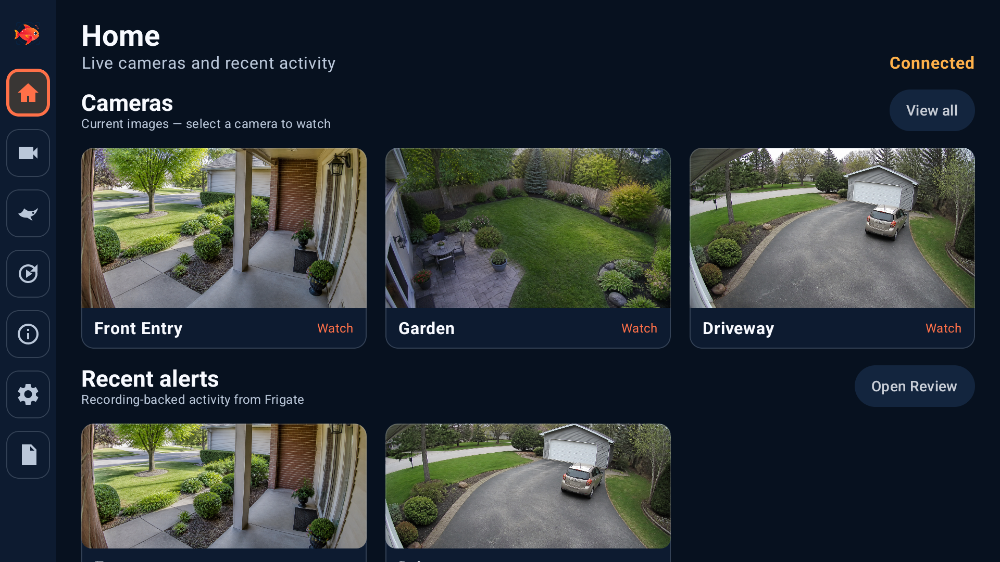
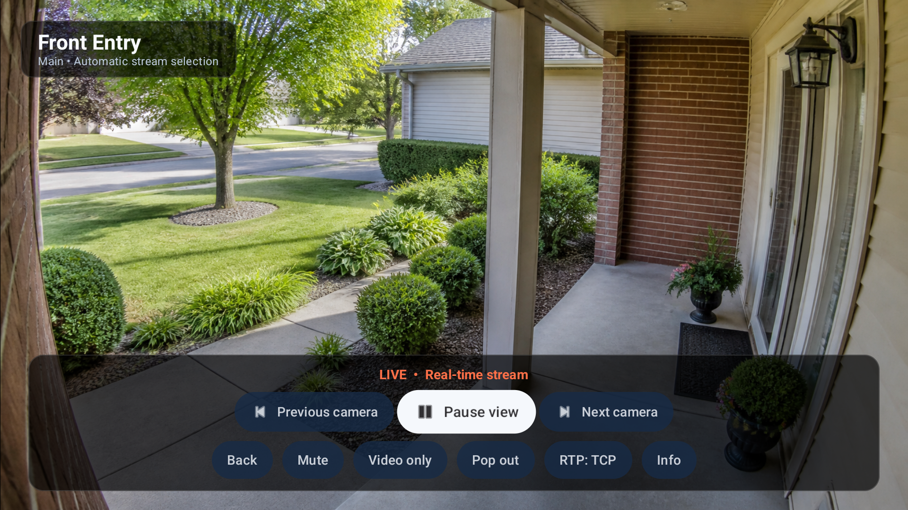
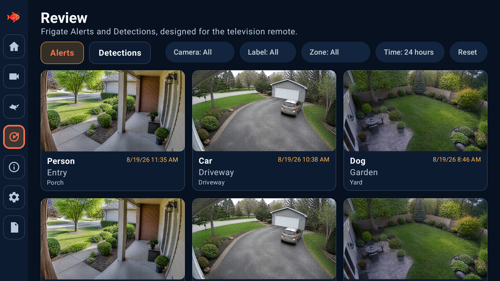
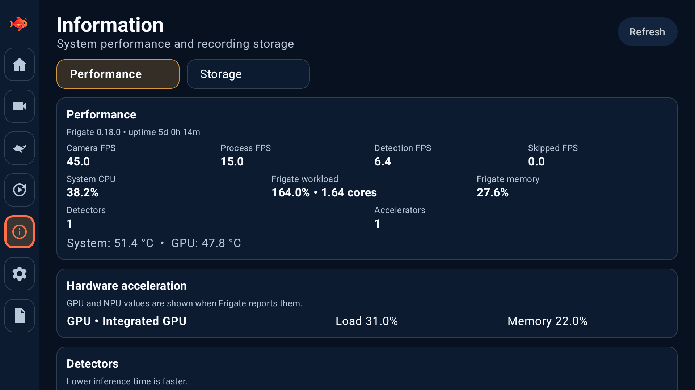

# Opah

Opah lets you view cameras and recordings from your
[Frigate security-camera system](https://frigate.video/) on an Android TV or
Google TV using a normal television remote.

Opah is an independent community project. It is not made, approved, or
supported by the Frigate team.

## What you can do

- See live views from your cameras
- Open Frigate Birdseye in a dedicated full-screen view
- Browse alerts and detections from Frigate Review
- Play recordings with a timeline and familiar video controls
- Keep a live camera visible in picture-in-picture while using another app
- Hear camera audio and mute it when needed
- View Frigate storage and performance information
- Find project, privacy, and support information on the in-app About page
- Choose a light, dark, system, or custom color theme
- Sign in automatically after the first successful connection

Opah is designed for a television remote. You do not need a mouse or touch
screen.

## Screenshots

| Home | Live camera |
| --- | --- |
|  |  |

| Review | System information |
| --- | --- |
|  |  |

See the [complete interface gallery](docs/screenshots.md). All camera scenes,
names, addresses, and data shown in the gallery are fictional examples.

## What you need

- A working Frigate server
- Android TV or Google TV running Android 7.0 or newer
- A Frigate username and password
- Network access from the TV to the Frigate server

Opah has been tested with Frigate 0.17.2 and the exact Frigate 0.18.0 beta 3
build `344efb6`. See the [compatibility guide](docs/compatibility.md) for camera
video formats, tested devices, and troubleshooting tips.

## Install Opah

Opah is currently downloaded from GitHub rather than Google Play.

1. Open the [latest GitHub release](https://github.com/VibeCodingAntagonist/opah-frigate-tv-app/releases).
2. Download the file whose name ends in `.apk`.
3. Follow the [step-by-step installation guide](docs/installation.md).

Only download Opah from this repository. Copies from other websites may have
been changed or may be unsafe.

## Connect for the first time

Opah asks for:

1. your Frigate server address;
2. your Frigate username; and
3. your Frigate password.

Use the same secure Frigate address you normally use in a web browser when
possible. Most people can leave the advanced connection settings unchanged.
Those settings are available for networks where live video uses a different
local address.

After a successful sign-in, Opah can securely remember the connection and sign
in automatically. Choose **Sign out** to remove the saved sign-in information.

## Important limitations

- Opah needs an existing Frigate server; it does not record cameras by itself.
- Pausing a live camera freezes the picture. It does not let you rewind live
  video.
- Camera audio plays from the TV, but speaking through a camera or doorbell is
  not supported.
- Picture-in-picture depends on support from the TV and Android version.
- Updates are manual. Download and open the newer APK when a new release is
  available.

## Privacy and safety

- Your Frigate password and saved sign-in are encrypted on the device.
- Opah does not send camera data through an Opah cloud service.
- Opah does not keep its own archive of camera recordings.
- The Diagnostics page is designed to leave out passwords, private addresses,
  and camera images.
- Use a secure `https://` Frigate address when one is available.
- Keep the live-video connection inside your trusted home or business network.

Read [Privacy and security](docs/security-model.md) for a fuller explanation.
Report a security concern through GitHub's
[private reporting form](https://github.com/VibeCodingAntagonist/opah-frigate-tv-app/security/advisories/new).

## Help and feedback

When reporting a problem, include the Opah version, Frigate version, TV model,
and a short description of what happened. Do not post your password, server
address, camera names or images, or unedited logs.

Developers who want to build or improve Opah should start with
[CONTRIBUTING.md](CONTRIBUTING.md).

## License

Opah is available under the [Apache License 2.0](LICENSE). Release history is in
[CHANGELOG.md](CHANGELOG.md).

Frigate and Frigate NVR are trademarks of Frigate, Inc. Opah uses those names
only to explain what the app works with.
