# Opah interface gallery

Every image below is a 1920×1080 Android TV screenshot made with fictional
example data and generated camera scenes. No real camera, account, server, or
private address appears in the gallery.

## Start and connection states

| Connecting | First-time connection |
| --- | --- |
| 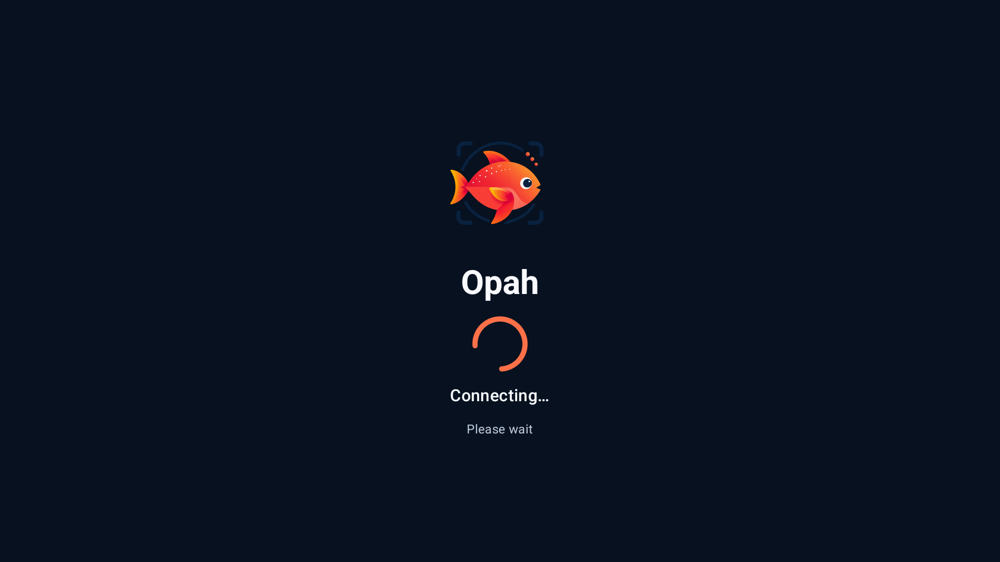 | 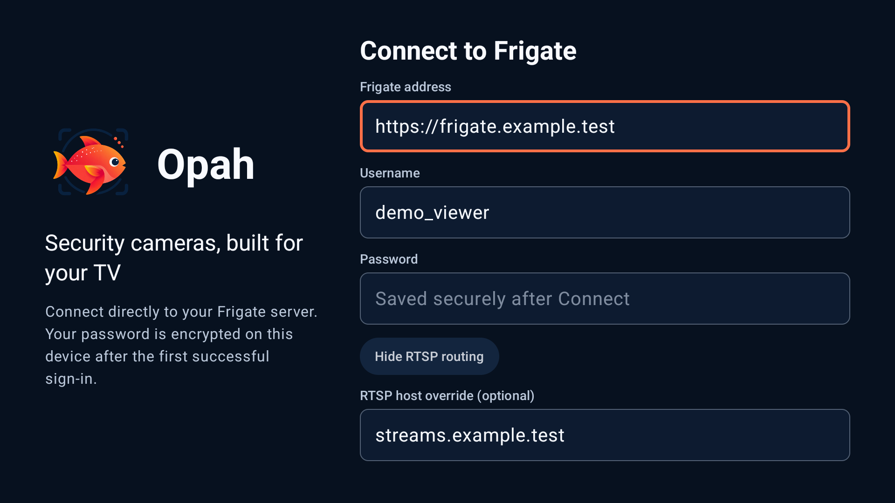 |

| Recoverable connection failure |
| --- |
| 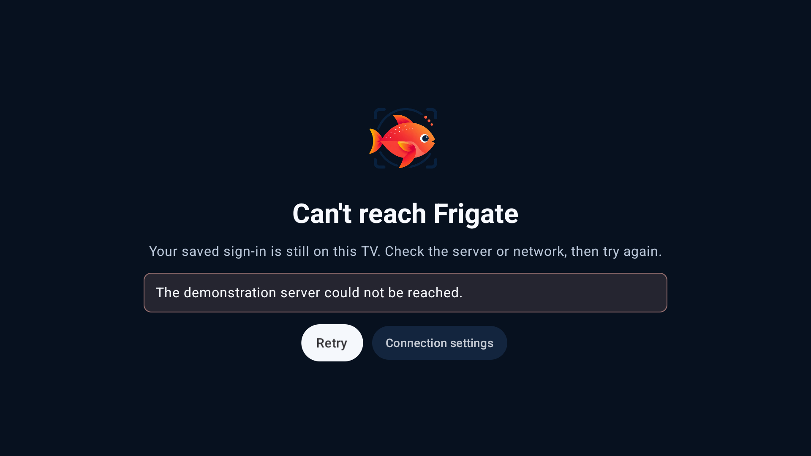 |

## Home and navigation

| Home | Expanded navigation |
| --- | --- |
|  | 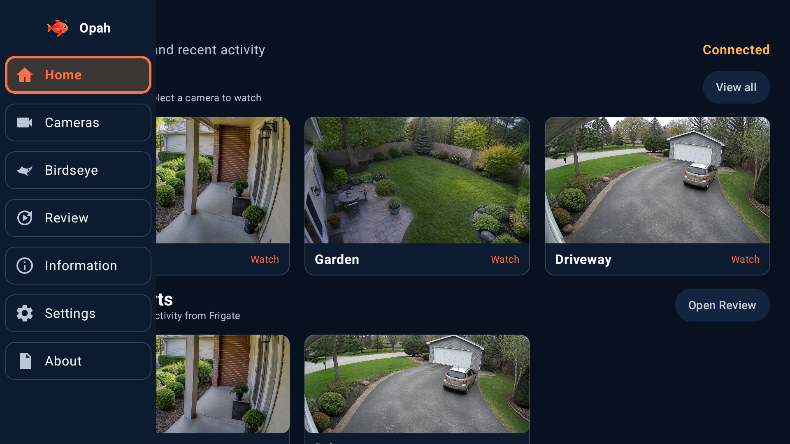 |

## Cameras and Birdseye

| Camera catalog | Birdseye |
| --- | --- |
| 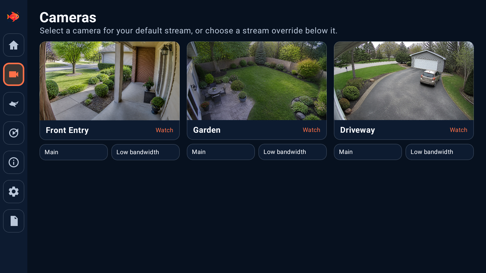 | 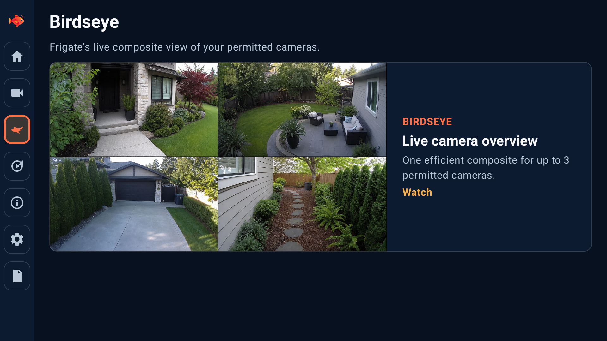 |

## Review

| Review grid | Review details |
| --- | --- |
|  | 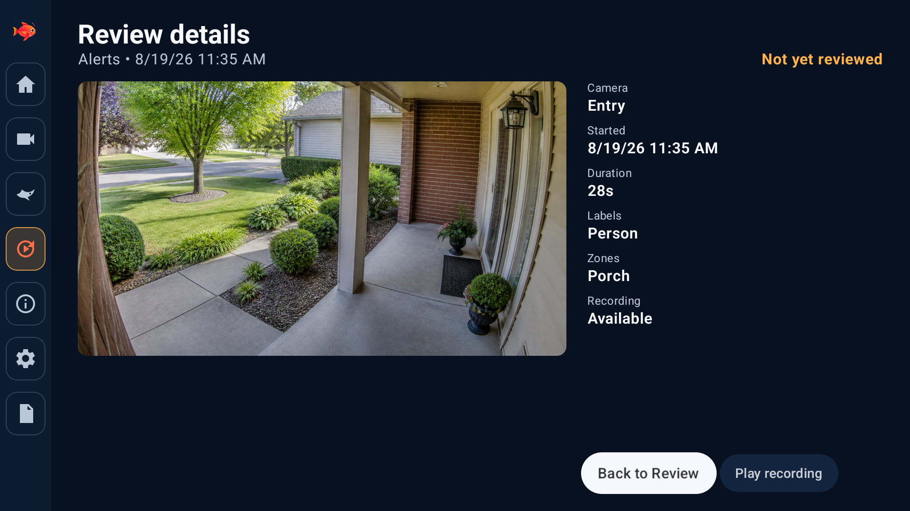 |

## Playback

| Live playback | Recorded playback |
| --- | --- |
|  | 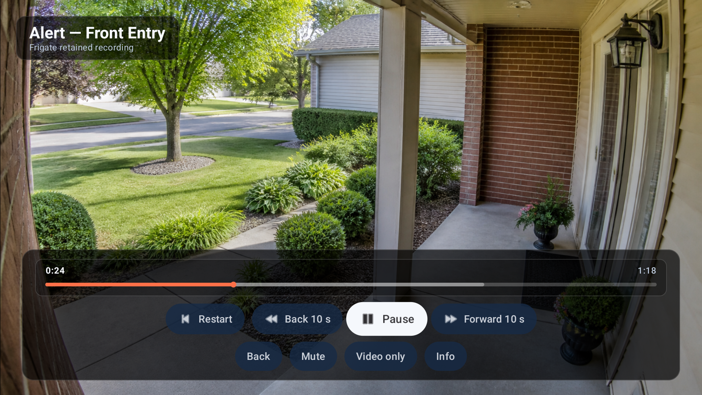 |

| Picture-in-picture |
| --- |
| 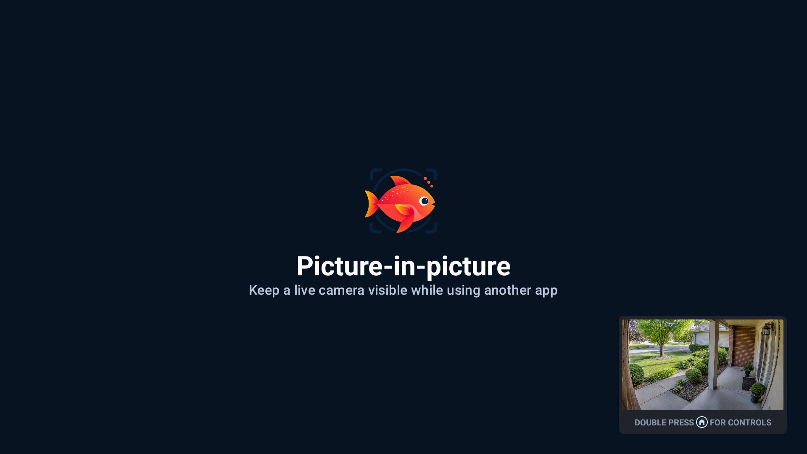 |

## Information

| Performance | Storage |
| --- | --- |
|  | 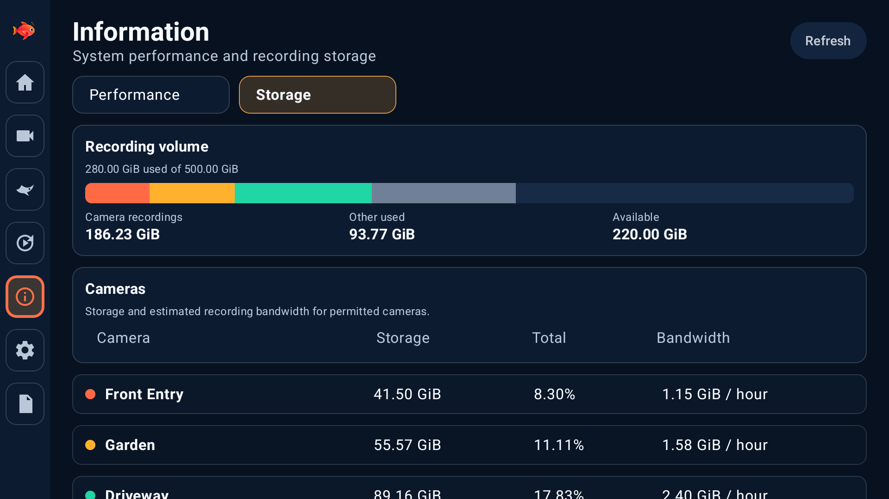 |

## Settings and diagnostics

| Settings | Custom theme editor |
| --- | --- |
| 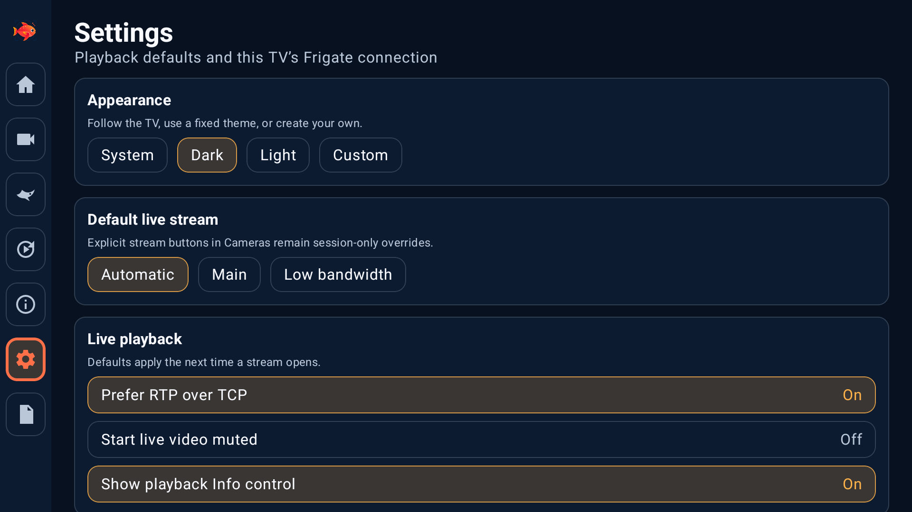 | 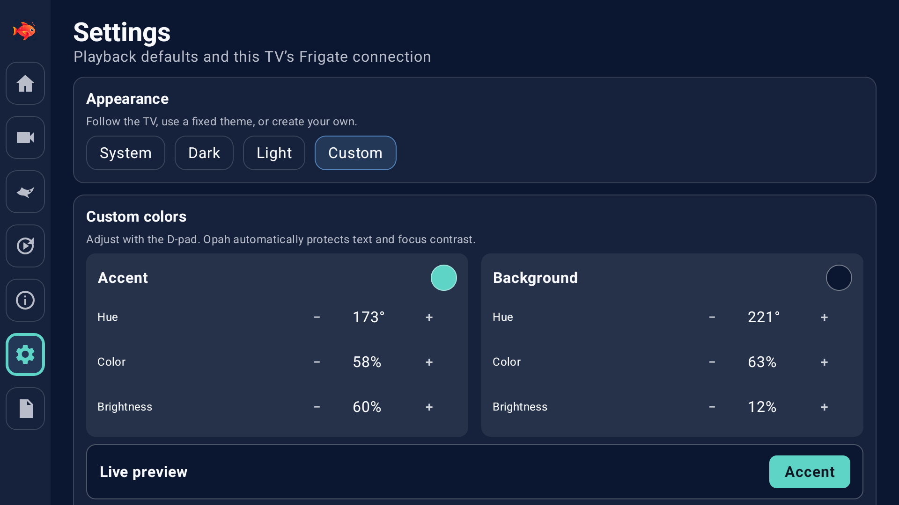 |

| Diagnostics |
| --- |
| 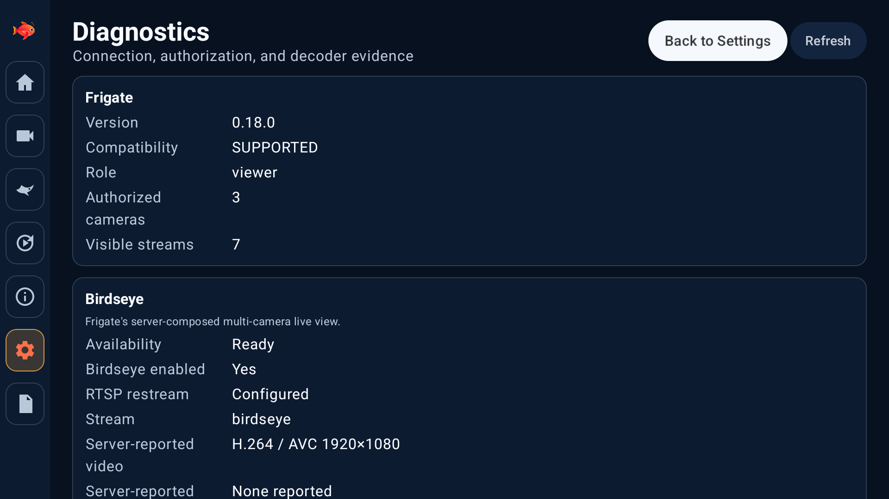 |

## About

| Project information and disclosures |
| --- |
| 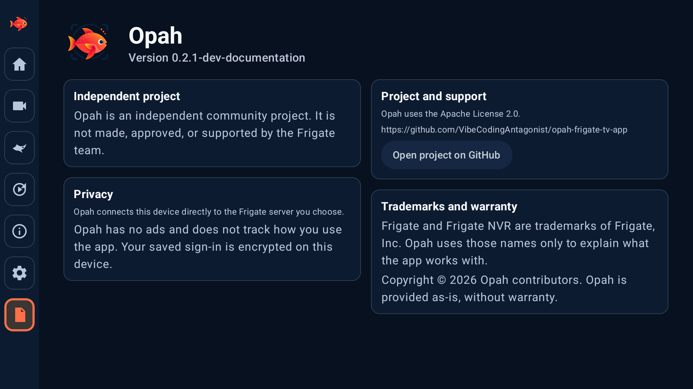 |
